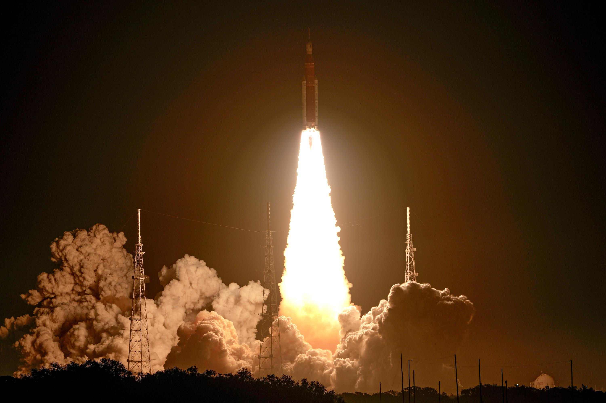
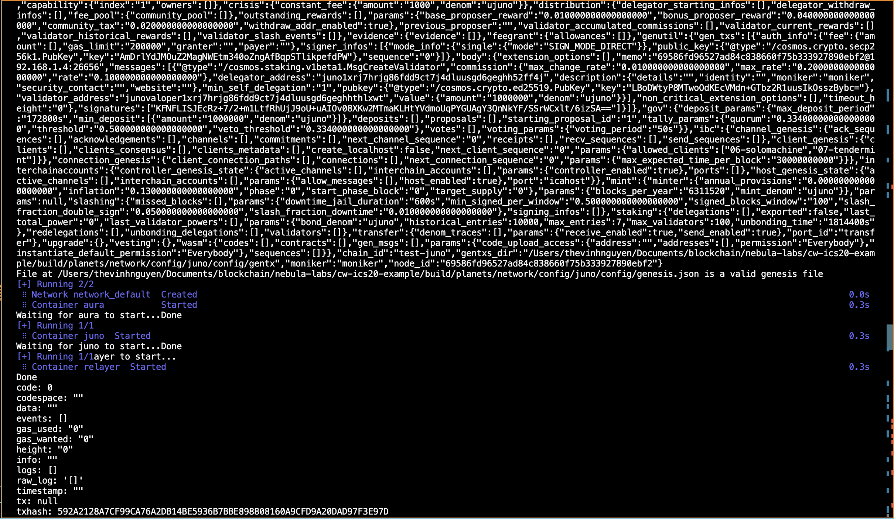

# Leaving Earth

The momentous occasion of the first space travel launching was a defining moment in human history, marking a leap forward in our understanding of the universe and our place in it. With the launch of the first spacecraft, humanity began a new era of exploration, pushing the boundaries of what was once thought impossible and unlocking the mysteries of the cosmos. This feat of technological achievement and human ingenuity not only expanded our scientific knowledge, but also sparked the imagination of generations to come, inspiring them to reach for the stars and continue our journey of discovery beyond the bounds of Earth.



# Tasks

Dear astronaut!

You are about to embark on an inter - galactic adventure. 
Many will fail but those who last will thrive.
I shall await you at the frontier of Cosmos.

Your goal is simple: build a smart contract that can sends token to another chain

## BASIC SETUP

1. start the galaxy

```
bash scripts/setup.sh
```



2. build smart contracts

```
bash build/planets/contract/scripts/build-contract.sh
```

## ADVANCED SETUP


3. deploy smart contracts
```
cd build/planets
bash contract/scripts/contract-download-alpha.sh
bash contract/scripts/contract-download-alpha.sh cw20_base

bash contract/scripts/deploy-contract.sh aura juno
```


4. reset relayer to reflect new cw20_ics20 wasm port

Get contract address cw20_ics20 from file `build/planets/contract/logs/contract-addresses.txt`

For example:
```
CONTRACT ADDRESS of cw20_ics20 on test-aura with address = aura1eyfccmjm6732k7wp4p6gdjwhxjwsvje44j0hfx8nkgrm8fs7vqfsalsm6u
```
Running bash script:

```
bash network/setup-relayer.sh aura juno wasm.aura1eyfccmjm6732k7wp4p6gdjwhxjwsvje44j0hfx8nkgrm8fs7vqfsalsm6u
```

5. send tokens
```
bash scripts/native-ibc-transfer.sh aura1eyfccmjm6732k7wp4p6gdjwhxjwsvje44j0hfx8nkgrm8fs7vqfsalsm6u
```